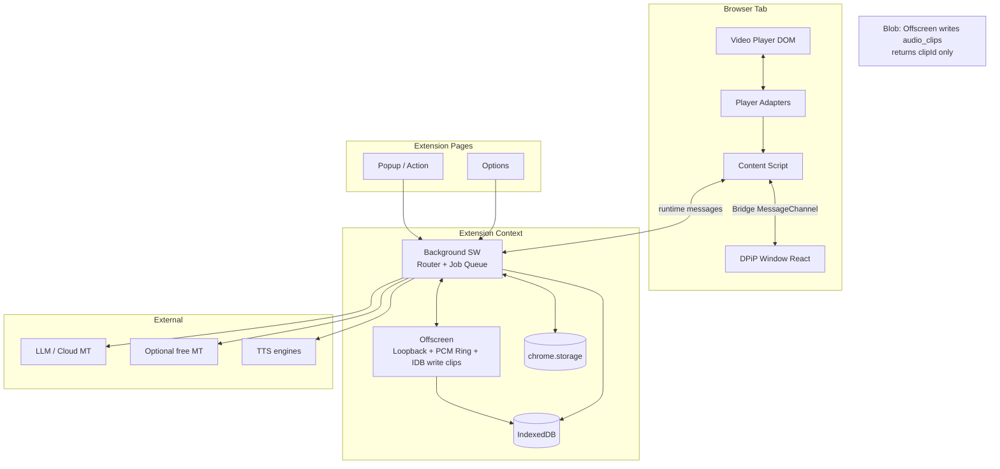
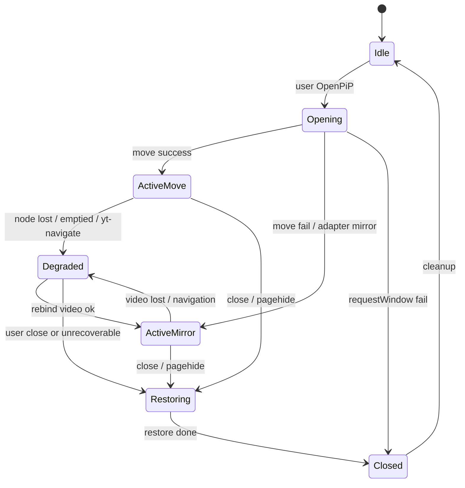
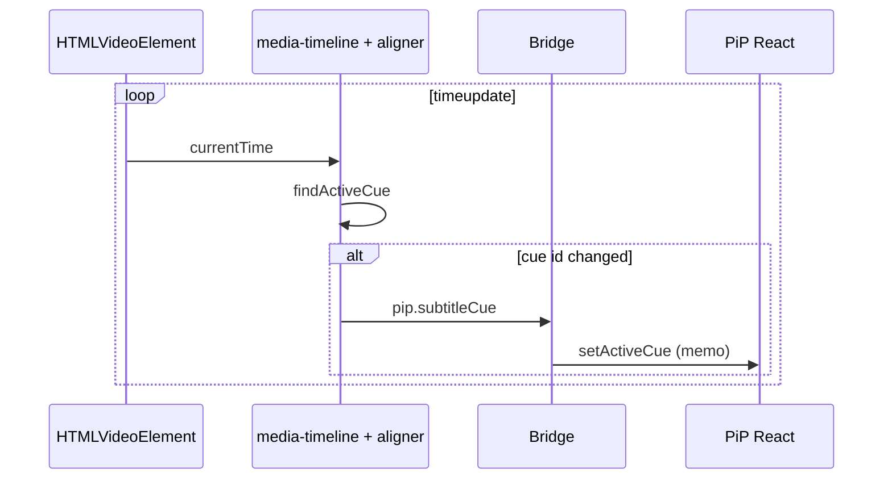
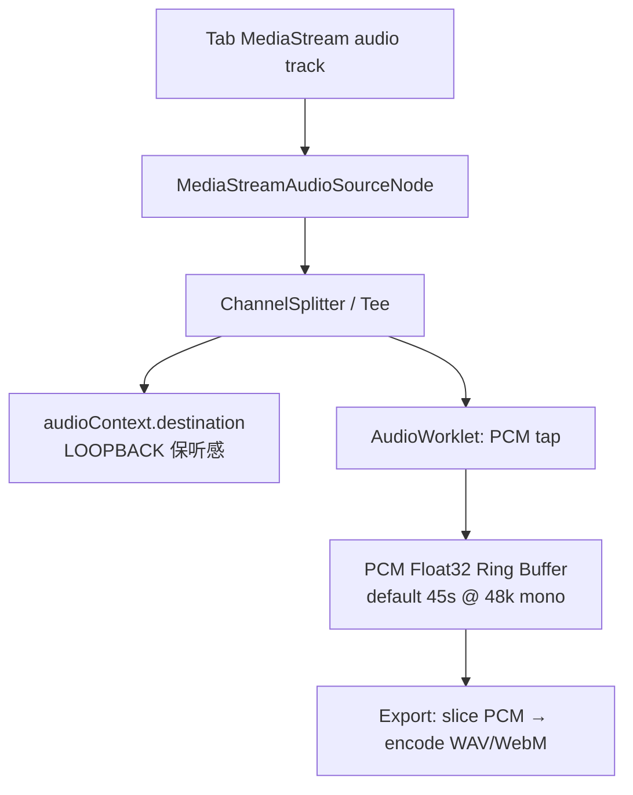
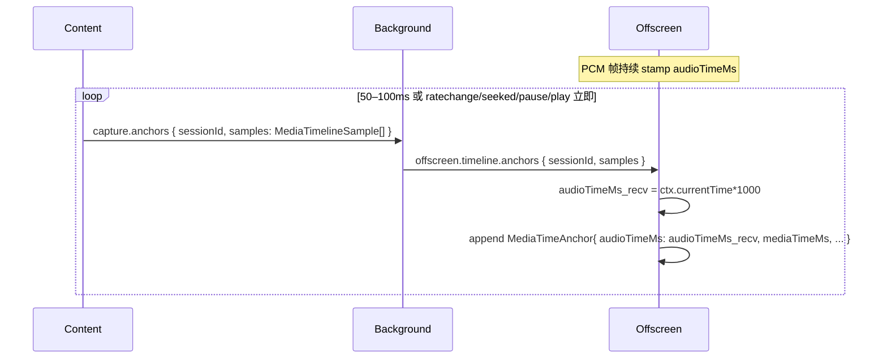
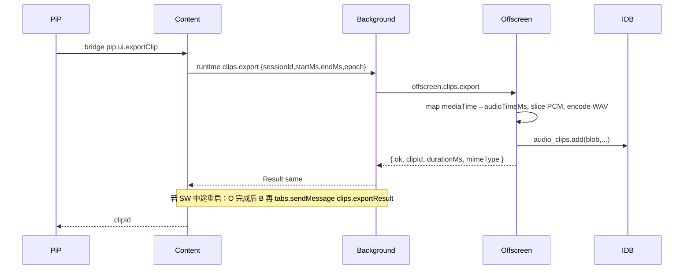
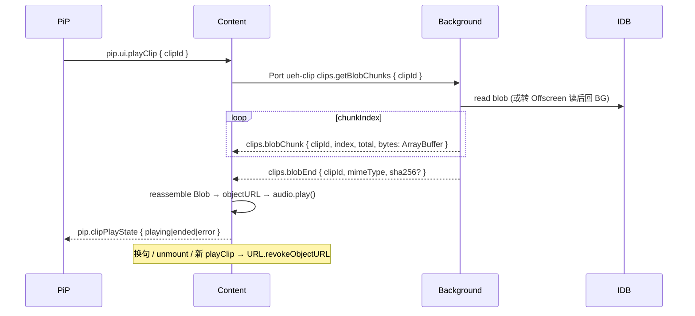
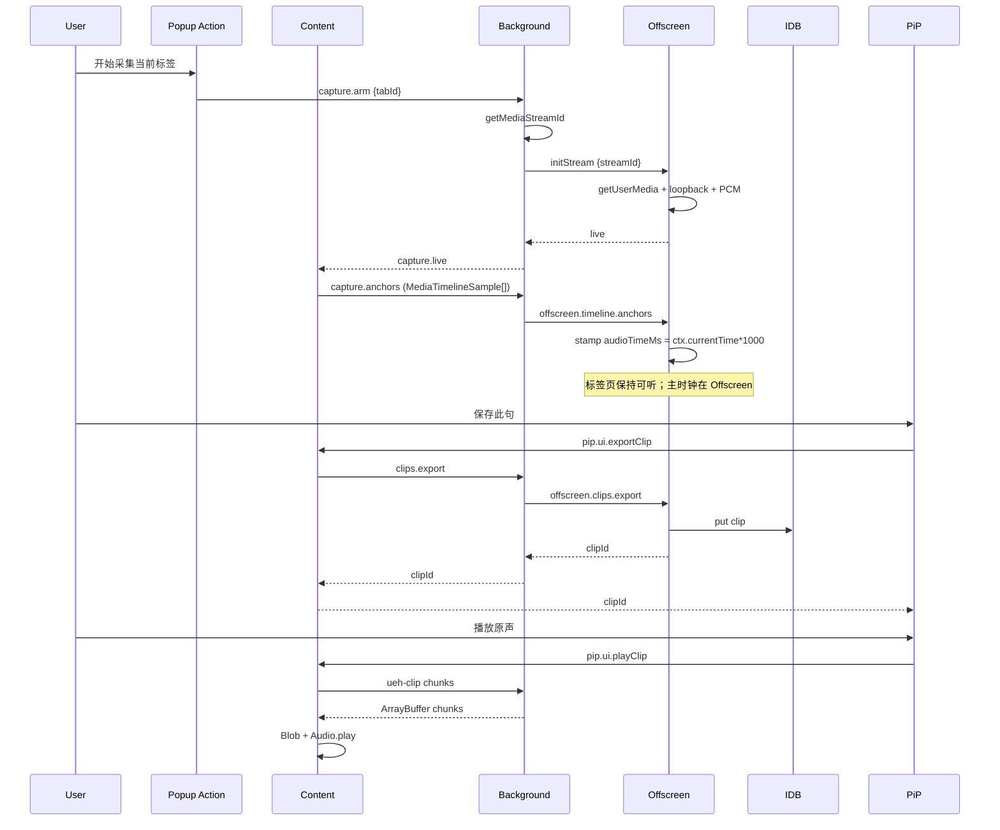

# UniEnglishHelper — 浏览器扩展技术架构设计文档

| 字段 | 内容 |
|------|------|
| **文档标题** | UniEnglishHelper Browser Extension Technical Architecture |
| **作者** | TBD（工程 Owner 待产品指定；架构修订：Design Review v0.3.2） |
| **日期** | 2026-07-12 |
| **状态** | Draft |
| **版本** | **v0.3.2**（产品决策关闭：MIT 许可 + 双模式 host 权限默认逐站） |
| **许可证** | read-frog GPL |
| **目标平台** | Chrome / Edge（Chromium）116+，Manifest V3 |
| **变更日志** | 见文末 [Changelog](#changelog) |
| **单源说明** | 本文件与仓库 `/Users/entity/Desktop/Language/JS/UniEnglishHelper/ARCHITECTURE.md` 保持同步；以本设计为实现真源 |

---

## Overview

**UniEnglishHelper** 是一款面向英语学习者的 Chrome/Edge Manifest V3 浏览器扩展（React + TypeScript）。其核心价值是：在**自定义 Document Picture-in-Picture（DPiP）**窗口中，将原视频、双语字幕、单词交互、原声音频剪裁与 AI/TTS 能力整合为「边看边学」闭环——而浏览器原生 PiP 既无字幕也无翻译。

本设计文档给出**可实施**的系统蓝图：冻结的构建工具链、跨上下文**完整消息 IDL**、IndexedDB 所有权规则、**tabCapture 环回 + PCM 环形缓冲 + mediaTime 锚点导出**、Capture Session UX（用户手势与 streamId 生命周期）、DPiP 会话状态机、权限最小化策略、clean-room 合规流程、安全桥接、SW/Offscreen 作业保活、可观测性、以及**以前置 spike 重排**的 PR 计划。

设计原则：

1. 视频质量优先（移动 `<video>`；失败时降级为页内视频 + PiP UI 镜像时间轴）  
2. 采音必须**保持标签页可听**（AudioContext loopback）  
3. 剪辑以 **PCM + mediaTime 锚点** 为真源，导出时再编码（禁止天真 WebM 切片）  
4. Service Worker 冷启动轻量；长任务落 Offscreen  
5. 翻译/TTS 激进缓存 + 官方后备通道  
6. 许可证洁净：**clean-room 流程**，附录仅为能力对等矩阵而非路径移植表  

---

## Background & Motivation

### 当前痛点

| 痛点 | 说明 |
|------|------|
| 原生 PiP 无字幕 | `HTMLVideoElement.requestPictureInPicture()` 仅投射视频轨，学习者离开页面即失去字幕与翻译 |
| 字幕与词典割裂 | 现有翻译扩展多为全文/页面翻译，缺少「按句原声 + 分词 + 生词本 + 复习」闭环 |
| 发音对照困难 | 原声口音不一；标准 TTS 与原声对照可加速语音肌肉记忆 |
| API 成本与延迟 | 视频字幕句数多，无缓存与 batch 会导致 LLM 费用与延迟不可接受 |
| MV3 能力约束 | Service Worker 无 DOM；tabCapture 会切断本地回放除非环回；跨域 video 连 Web Audio 易静音 |

### 产品能力摘要

1. **Custom DPiP**：双语字幕、可点击分词、Skill 面板  
2. **按句保存原声音频**：用于跟读 / 结构复习  
3. **分词 → 个人词典**：上下文 + 释义 + 关联音频  
4. **AI LLM**：字幕翻译、词义、用户自定义 SKILL（system prompt）  
5. **TTS**：优先 Edge 神经 TTS（非官方，可替换）+ 原声对照  

### 与 read-frog 的关系（能力参考，非代码源）

[read-frog](https://github.com/mengxi-ream/read-frog)（GPL-3.0 / 商业双许可）在产品能力上与本项目有重叠（多 Provider AI、字幕、TTS、Dexie）。**本项目许可证为 MIT（OQ1 已关闭 / KD21）**，**不把 read-frog 仓库作为编码参考**，不移植其 GPL 源码。允许的输入仅限：公开产品行为、公开文档、独立网络抓包/协议笔记、非 GPL 的第三方资料。完整流程见 [Legal / Clean-room 程序](#legal--clean-room-程序)（KD8）。

---

## Goals & Non-Goals

### Goals

- **G1** 在 Chrome/Edge 116+ 上提供稳定的 Document PiP 学习窗口（双语字幕 + 分词交互）  
- **G2** 支持通用 HTML5 `<video>`；YouTube 以 feature flag 渐进适配（含 move 失败降级）  
- **G3** 通过 `tabCapture` + Offscreen：**环回保听感** + **PCM 环缓冲** + 按 mediaTime 锚点导出并持久化音频  
- **G4** 本地生词本 + 简易间隔复习（stage + nextReviewAt）  
- **G5** 翻译双路径：可选免费 MT（默认关闭或明示）+ 用户自备 Key 的官方 LLM/云翻译；字幕上下文感知  
- **G6** TTS：可插拔引擎（Edge 非官方 / Web Speech / 用户 Azure Key）；IndexedDB 缓存  
- **G7** 完整类型化消息 IDL、Dexie schema 版本迁移、可测试服务边界  
- **G8** 安全存储 API Key；**双模式 optional host 授权（默认逐站，可选用户开启更广/全局 optional hosts）**（见权限策略 / KD17）；Content/PiP 样式与桥接隔离  

### Non-Goals（v1 明确不做）

- **NG1** Firefox / Safari  
- **NG2** 移动端 Chromium  
- **NG3** 自建账号/云同步/服务端中继（后续 RFC）  
- **NG4** Anki 级完整 SRS  
- **NG5** DRM 流媒体深度支持（Netflix 等 UI 标明不支持）  
- **NG6** Vercel AI SDK 进入 Service Worker  
- **NG7** fork / vendoring read-frog 源码  
- **NG8** 任意历史 cue 在 ring 窗口外的事后剪辑（v1 仅支持「有效锚点覆盖且仍在 ring 内」的句子）  

---

## Proposed Design

### 1. 核心技术栈

| 层级 | 选型 | 说明 |
|------|------|------|
| UI | React 18+ + TypeScript | Popup / Options / PiP bundle |
| 构建 | **Vite 5 + `@crxjs/vite-plugin`（冻结）** | 见 §4；禁止 PR-01 再摇摆 WXT/手工拷贝 |
| 样式 | Vanilla CSS + CSS Variables | Shadow DOM / PiP root 注入 |
| 存储 | Dexie.js → IndexedDB | 大体量 Blob 与缓存 |
| 配置 | `chrome.storage.local` / `session` | Key、flags、capture session 元数据 |
| 扩展 | Manifest V3 | SW + Offscreen + Content |
| 分词 | `Intl.Segmenter` | surface 词，无 lemma |
| AI | 轻量 `fetch` + SSE | OpenAI 兼容优先 |
| TTS | `TtsEngine` 接口 | Edge（可选）/ Web Speech / Azure |
| 测试 | Vitest + Playwright | 协议/DB 早测；DPiP fixture 从 PR-06 起 smoke |

### 2. 系统架构



**职责边界（修订）**

| 上下文 | 职责 | 禁止 |
|--------|------|------|
| Content Script | 播放器适配、DPiP 状态机、video move/mirror、Bridge 宿主、mediaTime 锚点采样上报 | 持有 API Key；直接 getMediaStreamId（见 Capture UX） |
| PiP React | UI；经 Bridge 发意图 | `chrome.*`（path A）；直接第三方 fetch |
| Background SW | 路由、配置、翻译/AI 编排、capture 编排、**轻量**任务；创建 Offscreen | MediaRecorder、AudioWorklet、长期 WebSocket 优先 |
| **Offscreen** | tab 流兑换、**loopback**、PCM ring、**导出编码**、**写入 `audio_clips` / 可选 tts 大 Blob** | UI；擅自发起跨域业务策略 |
| Popup/Action | **invoke 扩展**（capture 授权关键路径）、开关、状态徽章 | 复杂业务 |
| Options | 词典/Skills/Keys/诊断导出 | 视频控制 |

**IndexedDB 所有权**

| 表 | 主写者 | 读者 |
|----|--------|------|
| `audio_clips` | **Offscreen**（导出完成时） | BG 读元数据/分块读 Blob；**Content 仅经 Port 分块取 Blob 回放**（见 §7.7）；Options 同 Content 或直接扩展页读 |
| `tts_cache` | Offscreen（若 TTS 在 Offscreen 合成）或 BG（短音频 &lt; 256KB 可 BG 写） | Content/Options 回放路径与 clips 相同（分块 Port） |
| `translation_cache`, `words`, `skills`, `review_logs`, `meta` | **Background** | Options/Content 经消息 |

并发：单一 writer 惯例；跨上下文禁止双开冲突写同一 clip 行。SW 被杀时，进行中的 export 由 Offscreen 完成写库，再经 BG 投递 runtime `clips.exportResult` 到目标 tab 的 Content（Offscreen 存活策略见 §作业保活）。

**Content 永不直连 Offscreen**（不持有 `streamId`、不发 offscreen.* 消息）；所有 Offscreen 通信由 BG 编排。

### 3. 目录结构

```
UniEnglishHelper/
├── manifest.config.ts            # CRXJS 生成 manifest 的源配置
├── package.json
├── vite.config.ts                # @crxjs/vite-plugin；entries 见 §4
├── tsconfig.json
├── playwright.config.ts
├── src/
│   ├── shared/
│   │   ├── messages/             # 完整 IDL
│   │   │   ├── envelope.ts
│   │   │   ├── errors.ts         # ErrorCode 枚举
│   │   │   ├── runtime.ts        # Content/Popup/Options ↔ BG
│   │   │   ├── offscreen.ts      # BG ↔ Offscreen
│   │   │   ├── bridge.ts         # Content ↔ PiP
│   │   │   ├── stream.ts         # STREAM_* 流式
│   │   │   └── ports.ts          # 长连接 Port 约定
│   │   ├── domain/
│   │   ├── constants.ts
│   │   └── nfr.ts                # 预算常量
│   ├── background/
│   │   ├── index.ts
│   │   ├── router.ts
│   │   ├── jobs/                 # 可取消任务队列
│   │   └── services/
│   ├── content/
│   │   ├── pip-session.ts        # 状态机
│   │   ├── pip-host.ts
│   │   ├── bridge.ts
│   │   ├── media-timeline.ts     # mediaTime 锚点采样
│   │   └── players/
│   ├── offscreen/
│   │   ├── index.html
│   │   ├── index.ts
│   │   ├── audio-graph.ts        # loopback + worklet
│   │   ├── pcm-ring.ts
│   │   └── export-encode.ts      # PCM → wav/webm
│   ├── pip/
│   ├── popup/
│   ├── options/
│   ├── api/
│   ├── db/
│   ├── utils/
│   └── styles/
└── fixtures/
    └── html5-learning-page/      # 本地字幕+视频样例（Playwright）
```

### 4. 构建工具链（冻结）— KD1 / Issue 16

**冻结选择：`vite` + `@crxjs/vite-plugin`（不使用 WXT；不维护双轨手工 manifest 拷贝）。**

| Entry | 输出角色 | 备注 |
|-------|----------|------|
| `src/background/index.ts` | Service Worker | `background.service_worker` |
| `src/content/index.ts` | Content Script | 匹配命中的 host（见权限） |
| `src/offscreen/index.html` | **扩展页** Offscreen | `chrome.offscreen.createDocument({ url })`；不得被错误打成 content chunk |
| `src/popup/index.html` | Action Popup | |
| `src/options/index.html` | Options | |
| `src/pip/index.tsx` → `pip.js` + `pip.css` | **web_accessible_resources** | 供 Content 注入 DPiP 窗口（Path A） |

`web_accessible_resources`（最小集）：

```json
{
  "resources": ["pip.js", "pip.css", "assets/pip/*"],
  "matches": ["http://*/*", "https://*/*"],
  "use_dynamic_url": true
}
```

验收（PR-01）：`chrome://extensions` 加载成功；offscreen HTML 可 `createDocument`；`chrome.runtime.getURL('pip.js')` 可访问；HMR 以 CRXJS 默认为准，不自造第二套。

---

### 5. Document Picture-in-Picture（DPiP）

#### 5.1 加载方式 — 决策 KD13 / 关闭原 OQ2

**选定 Path A（注入）**：DPiP 窗口与 opener **同页 origin**；Content Script 向 `pipWindow.document` 注入 `pip.js`/`pip.css`（`web_accessible_resources`），建立 **MessageChannel** 桥。不在 v1 使用 `chrome-extension://` 作为 DPiP document URL（兼容性与权限面未验证，避免双路径）。

#### 5.2 视频策略：Move-first，Mirror 降级

| 模式 | 行为 | 何时 |
|------|------|------|
| **Move**（默认目标） | 将 `<video>` 移入 DPiP；原位放 placeholder | Generic HTML5；adapter 声明 `supportsMove: true` |
| **Mirror**（降级） | 视频留在页内；PiP 仅 UI + 字幕；时间轴由 Content 同步；用户仍听页内声音 | move 失败、YouTube 等 `supportsMove: false`、DRM/MediaKeys、节点被站点抢回 |

#### 5.3 PiP Session 状态机



| 状态 | 不变量 |
|------|--------|
| Idle | 无 pipWindow；无 bridge |
| Opening | 已 `requestWindow`；正在注入/移节点 |
| ActiveMove | video 在 PiP；placeholder 在原位 |
| ActiveMirror | video 在页内；PiP 无 video 或仅 poster |
| Degraded | 会话仍开但控制降级（禁用部分操作，黄条提示） |
| Restoring | 移回 video / 卸 React / 断 bridge |
| Closed | 终端；可回 Idle |

**事件处理**

| 事件 | 动作 |
|------|------|
| `pipWindow.pagehide` / leave | → Restoring |
| 页 `pagehide` / 满载导航 | 会话结束；无法跨 document 保活 DPiP |
| `yt-navigate` / SPA soft nav | → Degraded；尝试 `findVideo()` 重绑；失败则提示刷新 |
| video `emptied` / `loadstart`（换源） | 重锚 mediaTime；必要时 Degraded |
| 原生 video PiP 冲突 | 关闭原生 PiP 或提示用户；不同时支持 |
| 多 video | adapter 选主 video；UI 允许切换（v1 可固定第一个） |
| 跨域 iframe 播放器 | v1 不支持；提示 |
| DRM / MediaKeys | Mirror 或明确不支持 |

**YouTube v1 策略（KD14）**

- `enableYoutubeAdapter` 默认 **false**（beta 可按 spike 结果打开）  
- v1 **默认 Mirror 模式**（不强制 move），降低 ABR/控件/广告 DOM 破坏  
- Spike **S1** 必须在 fixture + YouTube 各跑 move 与 mirror；以报告决定是否对 YT 尝试 move  
- 字幕：多层获取失败 → 用户导入 VTT / 手动关闭学习模式  

#### 5.4 字幕同步与 React 性能（Issue 17）

- **对齐器跑在 Content Script**（非 React render 路径）  
- 向 PiP **仅在 cue 边界变化时**发送 `pip.subtitleCue`（换句）  
- 可选 **≤4Hz**（250ms）`pip.subtitleProgress` 用于卡拉 OK 进度，默认关  
- **禁止**每 rAF `setState` 全文字幕  
- 预取翻译：未来 N 条 cue（`features.prefetchCues`，默认 5）  



---

### 6. 播放器适配器

```typescript
export interface SubtitleCue {
  id: string;
  startMs: number;
  endMs: number;
  text: string;
  lang?: string;
}

export interface PlayerAdapter {
  readonly id: string;
  /** move 是否允许；YouTube v1 建议 false */
  readonly supportsMove: boolean;
  match(location: Location): boolean;
  findVideo(): HTMLVideoElement | null;
  getSubtitles(): Promise<SubtitleCue[]>;
  getToolbarMount(): HTMLElement | null;
  /** SPA 导航时清理 */
  destroy(): void;
}
```

---

### 7. 音频捕获与按句剪裁（核心修订）

#### 7.1 平台事实（必须遵守）

1. **tabCapture 会切断标签页本地出声**，除非将捕获流 **loopback** 到 `AudioContext.destination`（Chrome 文档 *Preserve system audio* 模式）。  
2. `getMediaStreamId` 返回的 ID **一次性**且 **数秒内未兑换即失效**。  
3. 扩展需处于 **invoked** 状态（典型：用户点击 **action/popup**，获得 `activeTab` 类能力）；纯页面 Content 按钮点击**不可假设**等同于扩展 invoke。  
4. MediaRecorder 的 WebM timeslice **不能**按 mediaTime 安全随机切片。

参考：[chrome.tabCapture](https://developer.chrome.com/docs/extensions/reference/api/tabCapture)、[Screen capture / offscreen 录制模式](https://developer.chrome.com/docs/extensions/mv3/screen_capture/)。

#### 7.2 Offscreen 音频图（Loopback + PCM）



伪代码要点：

```typescript
// offscreen/audio-graph.ts
const ctx = new AudioContext(); // 若 suspended → 需用户手势 resume（见 Capture UX）
const source = ctx.createMediaStreamSource(tabStream);
const gain = ctx.createGain(); // 1.0 loopback
source.connect(gain);
gain.connect(ctx.destination); // CRITICAL: preserve system/tab audio

// AudioWorkletNode 拉 PCM → pcmRing.push(frame, captureTime)
source.connect(workletNode);
// workletNode 不连 destination（避免双倍音量）；仅 loopback 经 gain
```

**验收（S2 / PR-Capture）**：启用 ring 后，**标签页/视频原声持续可听**；关闭 capture 后听感恢复正常；`AudioContext.state === 'suspended'` 时 UI 提示「点击恢复听感」并走 resume。

#### 7.3 主表示：PCM Ring + mediaTime 锚点（KD3 修订）

**Primary representation：PCM float32 mono ring（默认 48kHz，深度 `recorder.ringSeconds` 默认 45s）。**  
MediaRecorder **不**作为剪辑真源；可选并行 MediaRecorder 仅用于调试。

##### 7.3.1 时钟域（KD19 — 强制，关闭跨上下文歧义）

**禁止**使用页面 Content 的 `performance.now()` 作为与 PCM ring 对齐的 capture 时钟。不同文档时间原点互不相等，会导致系统级错位（秒级，而非毫秒级）。

| 角色 | 时钟 | 说明 |
|------|------|------|
| **Offscreen（主时钟）** | `audioTimeMs = audioContext.currentTime * 1000` | 每个 PCM 帧写入 ring 时打上该戳；导出插值**只**使用该域 |
| Content（媒体态） | `video.currentTime` → `mediaTimeMs` | 只报告媒体时间线与播放态 |
| 跨上下文粗同步 | `wallClockMs = Date.now()` | 双方墙上时钟，用于接收时刻对齐与可选 RTT 修正；**不是**导出插值主轴 |

**Content 发出的采样载荷**（不包含 page `performance.now()` / 伪 captureTime）：

```typescript
/** Content → BG（capture.anchors）；由 Offscreen 吸收后生成可插值锚点 */
export interface MediaTimelineSample {
  /** video.currentTime * 1000 */
  mediaTimeMs: number;
  playbackRate: number;
  paused: boolean;
  /** 单调递增；seek / 换源 / 主 video 切换时 Content +1 */
  epoch: number;
  /** Date.now()，与 Offscreen 接收时刻配对 */
  wallClockMs: number;
}
```

**Offscreen 内部锚点**（插值真源）：

```typescript
/** 仅存在于 Offscreen；PCM ring 与导出共用 audioTimeMs 域 */
export interface MediaTimeAnchor {
  audioTimeMs: number;   // = audioContext.currentTime*1000（主时钟）
  mediaTimeMs: number;
  playbackRate: number;
  paused: boolean;
  epoch: number;
  /** 可选：接收时的墙钟，用于诊断 */
  wallClockRecvMs?: number;
}
```

**同步协议（Content → BG → Offscreen）**



1. Content **永不**直连 Offscreen；**永不**持有 `streamId`。  
2. 路径固定：**Content → BG（`capture.anchors`）→ Offscreen（`offscreen.timeline.anchors`）**。高频可用 Port `ueh-anchors`（Content–BG），BG 再转发 Offscreen；端点见 §10.6。  
3. Offscreen 在**收到消息的瞬间**读取 `audioContext.currentTime` 作为该样本的 `audioTimeMs`（将 IPC 延迟折叠进「接收时刻 ≈ 采样时刻」模型）。  
4. **可选半 RTT 修正**（S2 若测得系统偏差 &gt; 80ms 再启用）：Content 发 `capture.anchors.ping` 带 `wallClockMs`；Offscreen/BG 回 `pong`；Content 估计 `rtt/2`，在后续 sample 的语义上提前/推后 media 报告（v1 默认关闭，S2 记录是否需要）。  
5. 导出插值**只**在 Offscreen 的 `MediaTimeAnchor[]` 上对 `audioTimeMs ↔ mediaTimeMs` 进行，与 Content 本地时钟无关。

**S2 对齐验收（硬门槛）**：fixture 在 media t=5.0s 处放置可听 beep；导出该时刻 ±0.25s 窗；测量 clip 内 onset 相对期望 **≤ ±100ms**（目标 ±50ms）。未达标不得关闭 PR-09。

##### 7.3.2 映射算法（导出时）

1. 仅接受 `epoch` 与当前 ring 有效 epoch 一致的锚点；**seek / 换源 / 主 video 切换 → epoch++**，ring 可导出区间从新 epoch 首个锚点起算（旧 PCM 可听但不可按旧 mediaTime 剪）。  
2. 在相邻锚点 \(A_i, A_{i+1}\) 间，对目标 `mediaT` **线性插值到 `audioTimeMs`**（非 page performance、非裸墙钟）。Content 必须在 `ratechange` / `seeked` / `pause` / `play` 时**立即**推送 sample。  
3. `playbackRate` v1 验收集：`{0.75, 1.0, 1.25}`；其它 **fail closed**（`CLIP_RATE_UNSUPPORTED`）。  
4. cue `[startMs, endMs]` 两端均能落入 ring 有效 `audioTime` 区间且 epoch 一致，否则 `CLIP_NOT_IN_RING` / `CLIP_EPOCH_MISMATCH`。  
5. 从 PCM ring **按 audioTimeMs 拷贝样本** → encode **WAV** → Offscreen 写 IDB → 返回 `clipId`。

**pause**：`paused: true` 的 sample 仍写入锚点序列；导出以 mediaTime 反查 audioTime，避免把长暂停墙钟空洞误当成媒体音频。

**广告/混音**：tab 总线含广告音是平台限制；UI 说明「保存的是标签页混音」。v1 不做广告剥离。

#### 7.4 导出与 Blob 所有权



- **禁止**将数 MB Blob 经 `runtime.sendMessage` 回传 SW 再写库。  
- 最大单句：默认 **30s** 媒体时长；超限 `CLIP_TOO_LONG`。  
- 编码格式 **KD15**：v1 默认 **`audio/wav`（PCM 16-bit）**。  

#### 7.5 Capture Session UX — 强制

**会话状态**（`chrome.storage.session` + Popup/PiP 徽章）：

`CaptureIdle | CaptureArming | CaptureLive | CaptureError`

| 步骤 | 行为 |
|------|------|
| 1. 用户意图 | PiP/工具条显示「启用原声采集」——**不直接**在 Content 调 `getMediaStreamId` |
| 2. Invoke | 打开 **Popup** 或点击 **action** 上的「开始采集当前标签」；此路径保证扩展 invoked + `activeTab` |
| 3. BG | 校验 `tabId`（`sender.tab` 或用户选中 tab）；`getCapturedTabs` 避免冲突；`getMediaStreamId({ targetTabId })` |
| 4. 立即兑换 | **&lt;1s 内** `offscreen.ensure` + `offscreen.capture.initStream`；失败 `STREAM_ID_EXPIRED` |
| 5. Loopback | Offscreen 建图；若 `AudioContext` suspended，返回需 resume；Popup 按钮二次点击 resume |
| 6. 锚点 | Content 收到 `capture.live` 后开始 `media-timeline` 采样 → **`capture.anchors` → BG → `offscreen.timeline.anchors`**（batch；见 §7.3.1） |
| 7. 导航/换 tab | 会话结束；徽章红点；需重新 invoke |
| 8. 停止 | Popup/PiP「停止采集」→ 停 worklet、断 track、可关 Offscreen（若无其它任务） |

**连续采集 vs 按次采集（KD16）**

- **v1 默认：会话级连续 PCM ring**（用户显式开启后保持到停止/导航）。  
- **拒绝默认「仅保存瞬间再 capture」**：streamId 手势成本高、句中开启易截断；作为 **fallback flag** `features.captureOnDemand` 在连续模式失败时可选。  

**错误码（采集）**：`NOT_INVOKED` | `STREAM_ID_EXPIRED` | `CAPTURE_ACTIVE` | `NO_AUDIO_TRACK` | `AUDIO_CONTEXT_SUSPENDED` | `TAB_MISMATCH` | `OFFSCREEN_FAILED`

**PiP 打开时是否自动 capture**：默认 **否**。先 Open PiP 学习字幕；原声保存前需一次「启用原声采集」。避免未 invoke 就失败的差体验。

#### 7.6 存储估算

- 45s × 48k × mono × float32 ≈ **8.6MB** 内存 ring  
- 导出 10s WAV 16-bit mono ≈ **960KB**  
- 用户日 50 句 ≈ 数十 MB → Options LRU / 上限提示  

#### 7.7 原声回放路径（页 origin PiP — KD20）

Path A 下 PiP 为**页面 origin**，不能直接打开扩展 IDB，也**不**把 `chrome-extension://` 对象 URL 当作可靠播放源。学习闭环要求 WordPopup / 控制条能在 PiP 内播放刚保存的句子。

**选定方案：Content 经 Port 分块取 Blob → `URL.createObjectURL` → 在 Content 持有的 `Audio` 上播放；PiP 只发控制信令。**



| 规则 | 约定 |
|------|------|
| 谁持有 Blob | **仅 Content**（或 Options 扩展页）；PiP **不**接收 ArrayBuffer |
| 传输 | Port **`ueh-clip`** 分块；**禁止** `sendMessage` 整包多 MB Blob |
| 块大小 | 默认 **256 KiB** / chunk；总大小上限 = `maxClipMs` 对应 WAV（30s mono 16-bit 48k ≈ 2.9MB） |
| Options | 可用同一 Port 协议，或扩展页内直接 Dexie 读（同 extension origin） |
| 校验 | 可选末包 `sha256`；失败 `DB_ERROR` / `PAYLOAD_TOO_LARGE` |
| 与 video 关系 | 播放 clip 时暂停/duck 视频音（产品可选，默认暂停 video） |
| 安全 | 仅 `clipId` 为 number 且属于本扩展 DB；sender 必须为 content/options |

Bridge 增量类型见 §10.4：`pip.ui.playClip` / `pip.ui.stopClip` / `pip.clipPlayState`。

---

### 8. 分词与生词本（Issue 18）

**v1 规则（关闭 OQ6 的工程歧义）**

- 只存 **surface form** + **`wordKey = surface.toLowerCase()`**  
- **不做 lemma**  
- `Intl.Segmenter` + `isWordLike`；点击过滤：剔除纯数字、单字符标点残留  
- 缩写/所有格（`I'm`）整段为 surface，可接受噪声  
- UI 可提示「合并/编辑词条」（Options 手动）  

```typescript
export interface WordRecord {
  id?: number;
  wordKey: string;       // lowercased surface, 索引
  surface: string;       // 原文大小写
  translation?: string;
  // ... 其余字段同前；删除模糊的 lemma 表述
}
```

---

### 9. AI / 翻译 / SKILL

#### 9.1 翻译路径与合规（Issue 12）

| 路径 | 默认 | 说明 |
|------|------|------|
| **用户云翻译 / LLM**（官方 API + 用户 Key） | 推荐生产默认 | OpenAI 兼容、Gemini、Google Cloud Translation、Azure Translator |
| **浏览器 Translator API**（若 `translation` API 可用） | 自动探测 | 无 Key 的合规后备 |
| **非官方 Free MT**（Google/Microsoft 网页接口仿造） | **默认关闭** `features.enableUnofficialFreeMt=false` | 有 ToS/风控/商店政策风险；开启时 UI **强制披露** |

免费/非官方 MT 设计要求：

- Spike **S3** 记录实际 endpoint、所需 host、CORS（扩展原点通常可直连）、限流表现  
- 客户端：指数退避、抖动、`429/503` 熔断、多 provider failover  
- 延迟 SLO **拆分**：缓存命中 p50 &lt; 30ms；未命中非官方 p50 不设硬 SLO（仅目标 &lt; 800ms）；官方 API 随网络  
- Beta 默认：官方 Key 或 Translator API；非官方 opt-in  

#### 9.2 轻量 Provider / SKILL / Batch

同前版接口思想：`AIProvider.chat` 支持 stream；Skills 存 `skills` 表；字幕 batch 降本。流式协议见消息 IDL `STREAM_*`。

#### 9.3 TTS 合规

- `TtsEngine`：`edge`（默认 **flag 关**）| `web-speech`（默认开作后备）| `azure`（用户 Key）  
- Edge：非官方，UI 披露；失败自动降级 Web Speech  
- 实现资料：**禁止**以 read-frog 源码为参考；允许公开协议笔记、自抓包、MIT/Apache 客户端  

---

### 10. 完整消息 IDL（Issue 6）

### 10.1 信封与错误码

```typescript
// shared/messages/envelope.ts
export type MessageSource =
  | 'content' | 'background' | 'offscreen' | 'pip' | 'popup' | 'options';

export interface Envelope<T extends string, P> {
  v: 1;
  channel: 'runtime' | 'offscreen' | 'bridge' | 'stream';
  type: T;
  requestId: string;
  source: MessageSource;
  payload: P;
}

export type Result<T> =
  | { ok: true; data: T }
  | { ok: false; error: { code: ErrorCode; message: string; details?: unknown } };

// shared/messages/errors.ts
export type ErrorCode =
  | 'UNKNOWN'
  | 'INVALID_MESSAGE'
  | 'UNAUTHORIZED_SENDER'
  | 'UNSUPPORTED_TYPE'
  | 'NOT_INVOKED'
  | 'STREAM_ID_EXPIRED'
  | 'CAPTURE_ACTIVE'
  | 'NO_AUDIO_TRACK'
  | 'AUDIO_CONTEXT_SUSPENDED'
  | 'TAB_MISMATCH'
  | 'OFFSCREEN_FAILED'
  | 'CLIP_NOT_IN_RING'
  | 'CLIP_RATE_UNSUPPORTED'
  | 'CLIP_TOO_LONG'
  | 'CLIP_EPOCH_MISMATCH'
  | 'PIP_UNSUPPORTED'
  | 'PIP_OPEN_FAILED'
  | 'VIDEO_NOT_FOUND'
  | 'MOVE_FAILED'
  | 'BRIDGE_AUTH_FAILED'
  | 'TRANSLATE_FAILED'
  | 'TTS_FAILED'
  | 'AI_FAILED'
  | 'AI_ABORTED'
  | 'RATE_LIMITED'
  | 'CONFIG_INVALID'
  | 'DB_ERROR'
  | 'PAYLOAD_TOO_LARGE';
```

**传输规则**

| 通道 | 机制 | 载荷限制 |
|------|------|----------|
| runtime | `chrome.runtime.sendMessage` / `onMessage` | 避免 &gt; ~64MB；**音频 Blob 禁止**；大文本截断 |
| Port | `chrome.runtime.connect` name: `ueh-<role>` | 流式 token、锚点 batch、进度 |
| offscreen | BG ↔ Offscreen 同扩展消息 | init/export/heartbeat |
| bridge | `MessageChannel` + sessionToken | 仅 Content 创建；PiP 不持有特权 |

### 10.2 Runtime 消息（Content / Popup / Options ↔ BG）

| type | 方向 | Request | Response |
|------|------|---------|----------|
| `sys.ping` | any→BG | `{}` | `{ version, swAlive: true }` |
| `config.get` | UI→BG | `{}` | `AppConfig` |
| `config.set` | Options→BG | `Partial<AppConfig>` | `AppConfig` |
| `pip.open` | Popup→BG | `{ tabId: number }` | `{ mode: 'move'\|'mirror' }` |
| `pip.close` | Content→BG | `{ tabId }` | `{}` |
| `capture.arm` | **Popup→BG** | `{ tabId }` | `{ sessionId }` 或错误 |
| `capture.stop` | Popup/Content→BG | `{ sessionId }` | `{}` |
| `capture.status` | any→BG | `{ tabId? }` | `{ state, sessionId?, loopbackOk? }` |
| `capture.anchors` | **Content→BG** | `{ sessionId, samples: MediaTimelineSample[] }` | `{ accepted: number }`（BG 转发 Offscreen；见 §7.3.1） |
| `capture.live` | **BG→Content** | `{ sessionId, tabId }` | 事件：采集已 live，可开始推 anchors |
| `translate.cues` | Content→BG | `{ cues, src, dst, mode }` | `{ items: {id,text}[] }` |
| `word.explain` | Content→BG | `{ word, surface, context, skillId? }` | `{ text, engine }` |
| `word.add` | Content→BG | `WordCreate` | `WordRecord` |
| `word.list` | Options→BG | `WordQuery` | `WordRecord[]` |
| `word.updateReview` | Options→BG | `{ id, result }` | `WordRecord` |
| `skill.list/save/delete` | Options→BG | … | … |
| `skill.run` | Content→BG | `{ skillId, text, context?, stream: true }` | 见 stream |
| `tts.synth` | Content/Options→BG | `{ text, voice?, rate? }` | `{ clipId? }`（短音频亦可走 `ueh-clip` 分块） |
| `clips.export` | **Content→BG** | `{ sessionId, startMs, endMs, epoch }` | `{ clipId, durationMs, mimeType }` |
| `clips.exportResult` | **BG→Content** | 同上 payload + `{ requestId? }` | 事件：SW 重启后补投递的异步完成通知 |
| `clips.getMeta` | Content/Options→BG | `{ clipId }` | 元数据（无 Blob） |
| `clips.getBlobChunks` | Content/Options→BG（**Port `ueh-clip`**） | `{ clipId }` | 见分块帧（§7.7）；**禁止**整包 Blob `sendMessage` |
| `cache.clear` | Options→BG | `{ scopes[] }` | stats |
| `diag.export` | Options→BG | `{}` | `DiagnosticBundle` |

**`clips.getBlobChunks` 帧（Port `ueh-clip`）**

```typescript
// Content/Options → BG
{ type: 'clips.getBlobChunks', requestId, clipId: number }
// BG → Content/Options
{ type: 'clips.blobChunk', requestId, clipId, index: number, total: number, bytes: ArrayBuffer }
{ type: 'clips.blobEnd', requestId, clipId, mimeType: string, byteLength: number, sha256?: string }
{ type: 'clips.blobError', requestId, clipId, code: ErrorCode, message: string }
```

**`pip.open` 转发**：BG `chrome.tabs.sendMessage(tabId, …)`；若无接收者 → `scripting.executeScript` 注入 content（需 host 已授权）→ 失败 `VIDEO_NOT_FOUND` / 无 host。

### 10.3 Offscreen 消息（BG ↔ Offscreen）

| type | 方向 | 说明 |
|------|------|------|
| `offscreen.ping` | BG→Off | 保活/健康 |
| `offscreen.capture.initStream` | BG→Off | `{ streamId, sessionId, tabId }` **立即 getUserMedia** |
| `offscreen.capture.stop` | BG→Off | 释放图与 track |
| `offscreen.capture.status` | BG→Off | loopback、ring 填充%、epoch |
| `offscreen.timeline.anchors` | **仅 BG→Off** | `{ sessionId, samples: MediaTimelineSample[] }`；Offscreen 转为内部 `MediaTimeAnchor`（打 `audioTimeMs`） |
| `offscreen.clips.export` | BG→Off | `{ sessionId, startMs, endMs, epoch }` → **写 IDB** → `{ clipId, durationMs, mimeType }` |
| `offscreen.clips.readChunk` | BG→Off | 可选：若 Blob 仅 Offscreen 打开 IDB 时由 Off 提供分块给 BG 再转 Content |
| `offscreen.tts.synth` | BG→Off | 可选：长 TTS 合成写 `tts_cache` |
| `offscreen.job.cancel` | BG→Off | `{ jobId }` |

### 10.4 Bridge 消息（Content ↔ PiP）

建立：Content `const { port1, port2 } = new MessageChannel()`；`pipWindow.postMessage({ type:'bridge.init', sessionToken, requestId }, origin, [port2])`；PiP 仅接受 `event.source === opener` 或固定 content 注入脚本上下文，并校验 `sessionToken`（随机 128-bit，会话级）。

| type | 方向 | 说明 |
|------|------|------|
| `bridge.hello` | 双向 | 能力协商 |
| `pip.subtitleCue` | C→P | `{ cue, neighbors?, translation? }` **仅换句** |
| `pip.subtitleProgress` | C→P | 可选 4Hz |
| `pip.playbackState` | C→P | `{ mediaTimeMs, paused, rate, captureState }` 低频 |
| `pip.command.playPause` | P→C | |
| `pip.command.seek` | P→C | `{ mediaTimeMs }` |
| `pip.command.setRate` | P→C | |
| `pip.ui.translateRequest` | P→C | 转发 BG |
| `pip.ui.explainWord` | P→C | |
| `pip.ui.addWord` | P→C | |
| `pip.ui.exportClip` | P→C | 当前 cue → Content 调 `clips.export` |
| `pip.ui.playClip` | P→C | `{ clipId }` → Content 走 §7.7 分块回放（PiP 不收 Blob） |
| `pip.ui.stopClip` | P→C | 停止 Content 侧 `Audio` |
| `pip.clipPlayState` | C→P | `{ clipId, state: 'loading'\|'playing'\|'ended'\|'error', message? }` |
| `pip.ui.tts` | P→C | |
| `pip.ui.runSkill` | P→C | |
| `pip.toast` | C→P | 错误/提示 |
| `pip.sessionState` | C→P | 状态机状态 |

页面脚本伪造：无 `sessionToken` 的 message 全部丢弃；不在 `window` 挂桥接函数。

### 10.5 流式模型

```typescript
// channel: 'stream' over runtime Port name `ueh-stream`
// skill.run / ai.chat
// BG → client:
{ type: 'stream.start', requestId, jobId }
{ type: 'stream.chunk', requestId, jobId, text: string }
{ type: 'stream.end', requestId, jobId }
{ type: 'stream.error', requestId, jobId, code: ErrorCode, message: string }
// client → BG:
{ type: 'stream.abort', requestId, jobId }
```

### 10.6 `ports.ts` 约定

| Port name | 端点 | 用途 | 生命周期 |
|-----------|------|------|----------|
| `ueh-stream` | Content/Options ↔ BG | LLM/Skill 文本流 | 请求级 |
| `ueh-anchors` | **Content ↔ BG** | 高频 `capture.anchors` batch（可选；亦可用 sendMessage 低频） | capture session；**BG 再转发 Offscreen** |
| `ueh-clip` | **Content/Options ↔ BG** | `clips.getBlobChunks` 分块 ArrayBuffer | 单次取 Blob 请求级 |
| `ueh-offscreen` | **BG ↔ Offscreen** | init/export/anchors/heartbeat 复用 | Offscreen 文档级 |

- Content **不**建立到 Offscreen 的 Port。  
- 无 `externally_connectable`（v1）。

---

## Data Model Changes

### Dexie Schema v1（字段修订）

```typescript
export interface WordRecord {
  id?: number;
  wordKey: string;
  surface: string;
  translation?: string;
  phonetic?: string;
  context: string;
  contextTranslation?: string;
  sourceUrl?: string;
  sourceTitle?: string;
  cueStartMs?: number;
  cueEndMs?: number;
  audioClipId?: number;
  tags?: string[];
  reviewStage: number;
  nextReviewAt: number;
  ease?: number;
  createdAt: number;
  updatedAt: number;
}

export interface AudioClipRecord {
  id?: number;
  blob: Blob;
  mimeType: 'audio/wav' | 'audio/webm' | 'audio/mpeg';
  durationMs: number;
  sampleRate?: number;
  sourceUrl?: string;
  startMs?: number;
  endMs?: number;
  epoch?: number;
  createdAt: number;
}

// TranslationCacheRecord / TtsCacheRecord / SkillRecord / ReviewLogRecord / MetaRecord
// 同 v0.2，另 meta 可存 DiagnosticBundle schemaVersion
```

索引：`words`: `++id, wordKey, nextReviewAt, createdAt, reviewStage`。

### AppConfig（统一 Feature Flags — Issue 9）

```typescript
export interface AppConfig {
  configVersion: number; // 当前 4（v0.3.2 起含 hostAccessMode）
  targetLang: string;
  sourceLang: string;
  translateEngine: 'official_llm' | 'cloud_mt' | 'browser_translator' | 'unofficial_free';
  /** OQ3/KD17：默认 per_site；global = 用户在 Settings 开启更广 optional hosts */
  hostAccessMode: 'per_site' | 'global';
  ai: {
    providerId: string;
    model: string;
    apiKeys: Record<string, string>;
    baseUrls?: Record<string, string>;
  };
  tts: {
    engine: 'web-speech' | 'edge' | 'azure';
    voice: string;
    rate: string;
  };
  pip: {
    width: number;
    height: number;
    subtitleFontSize: number;
    subtitleBgOpacity: number;
    preferMove: boolean; // false → 强制 mirror
  };
  recorder: {
    ringSeconds: number;      // 45
    sampleRate: number;       // 48000
    mimeType: 'audio/wav';
    maxClipMs: number;        // 30000
    supportedRates: number[]; // [0.75,1,1.25]
  };
  features: {
    autoTranslate: boolean;
    prefetchCues: number;
    enableLlmTranslate: boolean;      // default true if key present
    enableUnofficialFreeMt: boolean;  // default false
    enableTabCapture: boolean;        // default true (capability)
    enableEdgeTts: boolean;           // default false
    enableYoutubeAdapter: boolean;    // default false
    captureOnDemand: boolean;         // default false
    subtitleProgressEvents: boolean;  // default false
  };
}
```

**Beta 默认（PR-21）**：`hostAccessMode='per_site'`，`enableUnofficialFreeMt=false`，`enableEdgeTts=false`，`enableYoutubeAdapter=false`（S1 通过后可 true），`enableTabCapture=true`，TTS=`web-speech`。

---

## Alternatives Considered

### A1. 构建：WXT vs Vite+CRXJS

- WXT：DX 好，易与 GPL 项目同构。  
- **Vite + @crxjs/vite-plugin（选定并冻结）**。  

### A2. 视频：canvas vs move vs mirror

- canvas：画质差。  
- **move 优先 + mirror 降级（选定）**。  

### A3. 音频方案全集（扩展）

| 方案 | 听感 | 剪辑精度 | UX/权限 | v1 |
|------|------|----------|---------|-----|
| **tabCapture + loopback + PCM worklet ring** | 需正确 loopback | 高（锚点） | 需 invoke；连续占用 | **选定** |
| tabCapture + MediaRecorder WebM 切片 | 同左 | **低/易损坏** | 同左 | **拒绝作主路径** |
| 仅保存时短时 capture | 需二次手势 | 中（易截断句首） | 手势多次 | Fallback flag |
| `video.captureStream()` | 不静音页 | 同源才有音 | CORS 常无音轨 | 同源增强可选 |
| element WebAudio | 常静音 | 中 | 简单 | **拒绝主路径** |
| `getDisplayMedia` 选标签 | 用户混杂 | 中 | 重 UX | 拒绝 v1 |
| 无连续 ring、只记时间让用户手动上传 | — | — | 最差 | 拒绝 |

**连续采集成本**：CPU/内存见 NFR；浏览器可能显示「正在使用标签」类指示；必须 loopback 否则产品不可用。

### A4. AI SDK vs 轻量 fetch

**轻量（选定）**。

### A5. GPL fork vs clean-room

**MIT + clean-room 程序（选定，OQ1/KD21）**；非「对照路径移植」；拒绝为复用 read-frog 源码而改 GPL。

### A6. 状态：messaging + IDB 真源

**选定**；capture session 元数据在 `storage.session`。

---

## Security & Privacy Considerations

### 威胁模型

| 威胁 | 缓解 |
|------|------|
| 页面伪造 `postMessage` | MessageChannel 仅 Content 建立；`sessionToken`；校验 source |
| WAR 扩大 XSS 面 | WAR 仅 pip.js/css；`use_dynamic_url`；无 inline 敏感逻辑 |
| 恶意扩展消息 | `sender.id === runtime.id`；按 `source` 的 type allowlist；校验 `sender.tab` |
| API Key 泄露 | 仅 `storage.local`；永不进 Content/PiP props；日志脱敏；导出词典默认**不含** Key |
| 生词导出含敏感句 | Options「导出」提供 **redact URL / 仅词头** 选项 |
| 宽 host | 见下节 optional 策略 |
| 非官方 MT/TTS | 默认关 + 披露 |

### 权限策略（对齐 G8 / KD17 — OQ3 已关闭）

**v1 不把** `http://*/*` / `https://*/*` 写入强制 `host_permissions`。站点与 API 访问一律走 **`optional_host_permissions` + `permissions.request`**。

```json
{
  "permissions": [
    "storage",
    "offscreen",
    "tabCapture",
    "activeTab",
    "scripting",
    "tabs"
  ],
  "optional_permissions": ["unlimitedStorage"],
  "host_permissions": [],
  "optional_host_permissions": [
    "https://translate.googleapis.com/*",
    "https://translation.googleapis.com/*",
    "https://api.cognitive.microsofttranslator.com/*",
    "https://*.openai.com/*",
    "https://generativelanguage.googleapis.com/*",
    "https://speech.platform.bing.com/*",
    "https://*.youtube.com/*",
    "https://*.googlevideo.com/*",
    "http://*/*",
    "https://*/*"
  ]
}
```

**设置页双模式（OQ3 关闭）**

| 模式 | 默认 | 行为 |
|------|------|------|
| **Per-site（逐站）** | **是** | 在目标学习页首次启用功能时，对该 **origin**（或当前 tab 所需 host）调用 `chrome.permissions.request`；API 类 host（LLM/MT/TTS）在用户配置对应功能时按需请求 |
| **Broader / Global（更广/全局）** | 否（用户在 Settings 显式开关） | 用户确认后请求更宽 optional hosts（如 `https://*/*` + `http://*/*` 或等价全局 pattern），减少逐站弹窗；**仍是 optional_host_permissions，不是强制 host_permissions** |

- 切换到全局模式前：Settings 展示权限用途与隐私说明，需二次确认。  
- 可随时在 Settings 撤销 optional 授权（`permissions.remove`）并回退逐站模式。  
- 功能 flag（YouTube / Edge TTS / 非官方 MT）仍只在开启时请求对应窄域 host（即便全局模式已开，文档与 UI 仍列明用途）。

**按场景授予（在默认逐站模式下）**

| 场景 | 权限 |
|------|------|
| 用户在任意站点学 HTML5 | 对该 origin optional request |
| 官方 LLM / 云 MT | 按 provider baseURL 请求对应 host |
| YouTube flag | 请求 youtube / googlevideo hosts |
| Edge TTS flag | `speech.platform.bing.com` |
| 大缓存 | 可选 `unlimitedStorage` |
| 用户开启「全局站点访问」 | optional `http(s)://*/*`（非 manifest 强制） |

**G8 表述**：默认**已授权**集合最小化；站点/API 全部 optional；**默认逐站**，用户可选更广 optional 授权。设置页列出每权用途（隐私政策条目）。

`tabs`：用于 `pip.open` / capture 目标 tabId 校验，不读页面内容。

### 消息 sender 校验伪代码

```typescript
function assertSender(sender: chrome.runtime.MessageSender, expected: MessageSource) {
  if (sender.id !== chrome.runtime.id) throw unauthorized();
  // content: require sender.tab?.id
  // offscreen: url === offscreen.html
  // popup/options: url path check
}
```

### Legal / Clean-room 程序（Issue 5）

**禁止**将附录当作 file-to-file port map。强制流程：

1. **隔离**：实现某模块时，不打开 GPL 仓库对照编码；不把 read-frog 克隆进 monorepo。  
2. **规格输入**：产品 UX、公开文档、自建协议笔记（抓包摘要、无粘贴 GPL 源）、MIT/Apache 依赖。  
3. **独立实现**：自有目录与 API 命名。  
4. **依赖 allowlist**：第三方库需许可证扫描（Apache/MIT/BSD）；拒绝 GPL 依赖。  
5. **PR 模板**：`Sources consulted:` 必填；审核人可要求重写。  
6. **禁止**「CI 相似度 = 合法」作为唯一闸门（可辅助，不可替代流程）。  
7. **许可证（OQ1 已关闭 / KD21）**：本项目 **MIT**。继续 clean-room；**不得**为图省事合并 read-frog 或其它 GPL 源码。若未来有人提议改 GPL 并合法合并外部 GPL，须**另开 RFC** 并整体重评许可，不在 MIT 分支偷渡。  

附录 C = **能力对等矩阵 only**。

仓库根目录应包含 `LICENSE`（MIT 全文）与 README 许可声明；PR-01 脚手架即写入。

---

## Observability & 作业保活（Issue 14）

### 作业放置

| 工作负载 | 运行位置 | 保活 |
|----------|----------|------|
| 路由/配置/短翻译 | SW | 常规 |
| LLM 长流式 | SW + Port；**心跳** `stream.chunk`；可 `offscreen` 代 fetch 若 SW 不稳 | job 可 cancel |
| Edge TTS WebSocket | **Offscreen 优先** | Offscreen 文档保持 |
| PCM ring / export | **Offscreen** | capture session 期间不关文档 |
| IDB 大写 | Offscreen/BG 按表所有权 | export 完成前 `offscreen.ping` 看门狗 |

**Job Queue（BG）**：`maxConcurrentAi=2`，`maxConcurrentExport=1`；`jobId` + abort。

**Watchdog**：每 10s `offscreen.ping`；连续 3 次失败 → capture 标 Error、通知 UI。

### 日志与诊断包

```typescript
interface DiagnosticBundle {
  schemaVersion: 1;
  exportedAt: number;
  appVersion: string;
  config: Omit<AppConfig, 'ai'> & { ai: { providerId: string; model: string; hasKeys: string[] } };
  metrics: Record<string, number>;
  logs: Array<{ t: number; level: string; msg: string; requestId?: string }>; // 最近 500，已脱敏
  captureLastError?: string;
  nfrSamples?: unknown;
}
```

### 指标

同前：`translate.cache_hit_rate`、`recorder.export_success_rate`、`pip.open_success_rate`、`capture.loopback_ok` 等。

---

## 非功能需求与测试矩阵（Issue 19）

### NFR 预算（参考机：近几年笔记本，Chrome 稳定版）

| 项 | 预算 |
|----|------|
| PCM ring 稳态 CPU | &lt; 5% 单核平均（48k mono worklet） |
| DPiP + 双语 UI 空闲 | 不明显掉帧；字幕换句延迟 &lt; 100ms |
| 导出 10s clip p95 | &lt; 1.0s（PCM 已在 ring） |
| SW 冷启动至可 ping | &lt; 200ms 包体目标（无 AI SDK） |
| translation 缓存命中 | p50 &lt; 30ms |
| ring 内存 | ≈ `ringSeconds * sampleRate * 4` 字节 |

### 测试矩阵

| 维度 | 覆盖 |
|------|------|
| 浏览器 | Chrome 116、当前稳定版、Edge 稳定版 |
| Fixture | `fixtures/html5-learning-page` 含 VTT |
| 播放率 | 0.75 / 1.0 / 1.25 |
| Capture | loopback 可听；export 成功；seek 后旧句失败码 |
| YouTube | 登出/登录抽样（flag on）；mirror 为主 |
| 权限 | 未授权 host / 已授权；未 invoke capture |

M6 成功标准（可测）：在 flag 开启时，**预定义 10 个热门视频列表**中字幕加载成功率 ≥ 70%（登录态另计）；否则保持 flag 默认关。

---

## Risks & Mitigations

| ID | 风险 | 严重度 | 缓解 |
|----|------|--------|------|
| R1 | DPiP 平台变更 | 中 | 特性检测；Mirror/侧栏 RFC |
| R2 | YouTube 字幕/反爬 | 高 | flag；mirror；导入 VTT；S1 |
| R3 | Edge TTS ToS/失效 | 高 | 默认关；Web Speech/Azure |
| R4 | streamId/手势/静音 | 高 | Capture UX + loopback 验收 |
| R5 | 广告混音 | 中 | 产品说明 |
| R6 | SW 杀长任务 | 中 | Offscreen 作业 + watchdog |
| R7 | 商店权限 | 中 | optional hosts |
| R8 | GPL 污染 | 高 | clean-room 程序 |
| R9 | IDB 配额 | 低 | LRU；optional unlimitedStorage |
| R10 | SPA 丢 video | 中 | 状态机 Degraded + rebind |
| R11 | WebM 切片错误 | 高 | **已消除主路径**（PCM） |
| R12 | 非官方 MT | 中 | 默认关 + 披露 + 官方后备 |

---

## Open Questions

1. ~~**OQ1 许可证**~~ → **已关闭：MIT**（KD21）；继续 clean-room，禁止 GPL 源码移植。  
2. ~~OQ2 PiP 加载~~ → **已关闭：Path A 注入**（KD13）。  
3. ~~**OQ3 host 权限**~~ → **已关闭：双模式**——Settings 提供逐站 / 更广(全局) optional 授权；**默认 = 逐站**；全局仅为 optional_host_permissions 用户开关（KD17）。  
4. Netflix 文案强度 — 建议硬编码「不支持 DRM 站点」。  
5. 云同步 roadmap — 非 v1。  
6. ~~lemma~~ → **v1 不做**（surface + wordKey）。  
7. ~~WebM vs WAV~~ → **v1 WAV**（KD15）。  
8. 多语言分词 — v2。  

---

## References

- [Document Picture-in-Picture API — MDN](https://developer.mozilla.org/en-US/docs/Web/API/Document_Picture-in-Picture_API)  
- [Chrome Document PiP](https://developer.chrome.com/docs/web-platform/document-picture-in-picture)  
- [chrome.tabCapture](https://developer.chrome.com/docs/extensions/reference/api/tabCapture)（含 stream 使用与 offscreen 模式；**Preserve system audio / 本地听感需 loopback**）  
- [chrome.offscreen](https://developer.chrome.com/docs/extensions/reference/api/offscreen)  
- [MV3 screen capture guide](https://developer.chrome.com/docs/extensions/mv3/screen_capture/)  
- Chrome 扩展消息大小 / structured clone 限制（实现时查当前 Chromium 文档）  
- [Dexie.js](https://dexie.org/)  
- [Intl.Segmenter](https://developer.mozilla.org/en-US/docs/Web/JavaScript/Reference/Global_Objects/Intl/Segmenter)  
- [read-frog](https://github.com/mengxi-ream/read-frog)（**产品能力参考 only，非源码依赖**）  
- @crxjs/vite-plugin 文档  

---

## Key Decisions

| # | 决策 | 理由 |
|---|------|------|
| KD1 | **Vite + @crxjs/vite-plugin 冻结** | 可预测 MV3 多页；Offscreen/WAR 可配置 |
| KD2 | **DPiP Move-first + Mirror 降级** | 画质与站点兼容平衡 |
| KD3 | **tabCapture + AudioContext loopback + PCM ring + mediaTime 锚点导出** | 保听感；可实现时间对齐；拒 WebM 主切片 |
| KD4 | **BG 特权路由；PiP 仅 Bridge** | 减 Key 暴露 |
| KD5 | **轻量 fetch/SSE** | SW 体积 |
| KD6 | **Dexie 缓存/词典；clips 由 Offscreen 写** | Blob 不经 SW 大消息 |
| KD7 | **完整 Envelope IDL + ErrorCode** | 可实施路由 |
| KD8 | **Clean-room 程序**（非路径移植） | 在 MIT 下保持许可洁净 |
| KD9 | **TtsEngine 可插拔；Edge 默认关** | ToS/稳定性 |
| KD10 | **Intl.Segmenter；surface+wordKey** | 简单可预期 |
| KD11 | **storage 配置 / IDB 大体量** | 职责分离 |
| KD12 | **Feature flags 统一进 AppConfig.features** | 与 rollout 一致 |
| KD13 | **PiP Path A 注入 + WAR** | 关闭 OQ2 |
| KD14 | **YouTube 默认 Mirror + flag** | 降风险 |
| KD15 | **导出默认 WAV** | 关闭 OQ7 |
| KD16 | **连续 capture session（显式启用）** | 手势一次；on-demand 后备 |
| KD17 | **Host 双模式：默认逐站 optional request；用户可选更广/全局 optional hosts；强制 `host_permissions` 保持空** | 关闭 OQ3；对齐 G8 |
| KD18 | **Popup/Action 作为 capture invoke 入口** | 平台 tabCapture 约束 |
| KD19 | **Offscreen `AudioContext.currentTime` 为 capture 主时钟**；Content 只报 media+wallClock；锚点在 Offscreen 合成 | 消除跨文档 `performance.now()` 错位 |
| KD20 | **PiP 原声回放：Content 经 `ueh-clip` 分块取 Blob + 本地 Audio；PiP 仅控制信令** | 页 origin 无法直读 IDB；避免多 MB sendMessage |
| KD21 | **项目许可证 MIT**；继续 clean-room，禁止从 read-frog 等 GPL 源移植代码 | 关闭 OQ1 |

---

## PR Plan（重排 + 前置 Spike）

原则：**先契约与 spike，再 UI 堆叠**；协议/DB 单测前移；DPiP smoke 自 PR-06 起；capture 拆「环回可听」与「锚点导出」；词典不硬依赖 clip。

### 阶段 0 — 契约与工具链

#### PR-01：冻结工具链骨架
- **标题**：`chore: Vite+CRXJS MV3 scaffold (frozen toolchain)`  
- **影响**：package、vite、manifest.config、空 background/content/offscreen/popup/options、WAR 占位、fixtures 目录、**`LICENSE`（MIT）**  
- **依赖**：无  
- **描述**：加载扩展；offscreen 可创建；**明确不用 WXT**；写入 MIT `LICENSE` 与 README 许可声明。  

#### PR-02：消息 IDL + 路由 + 错误码 + 单测
- **标题**：`feat(shared): complete message IDL and background router`  
- **影响**：`shared/messages/*`、`router.ts`、Vitest  
- **依赖**：PR-01  
- **验收**：discriminated unions（含 `capture.anchors`、`clips.export` / `exportResult`、`clips.getBlobChunks` 帧、bridge `playClip`）；sender 校验；Content 不可直达 offscreen.*；未知 type 拒绝；stream/ports 类型完整。  

#### PR-03：Dexie schema + repository + 单测
- **标题**：`feat(db): schema v1 repositories`  
- **影响**：`db/*`、domain  
- **依赖**：PR-01  
- **描述**：可与 PR-02 并行。  

#### PR-04：AppConfig + 全量 feature flags + Settings 壳
- **标题**：`feat(config): AppConfig flags and secure key storage`  
- **影响**：Settings、config service、permissions UX  
- **依赖**：PR-02、PR-03  
- **描述**：flags 与本文一致；Key 掩码；**host 双模式开关（默认逐站；可选更广 optional hosts）** 与权限说明文案。  

### 阶段 1 — 平台 Spike（可并行）

#### PR-S1：DPiP + video move/mirror spike
- **标题**：`spike: DPiP move vs mirror on fixture and YouTube`  
- **影响**：实验分支或 `spikes/dpip/`；报告写入 `docs/spikes/S1.md`  
- **依赖**：PR-01  
- **验收**：fixture move 成功；YouTube 结论（move 是否可行）；WAR 注入验证。  

#### PR-S2：tabCapture loopback + PCM 导出 spike
- **标题**：`spike: tabCapture loopback and PCM clip export`  
- **影响**：`spikes/capture/`；报告 `docs/spikes/S2.md`  
- **依赖**：PR-01、权限  
- **验收**：**采集中视频保持可听**；按 **§7.3.1 主时钟协议** 导出 WAV；fixture beep @ media t=5.0s 的 clip onset **≤ ±100ms**；记录 gesture/streamId 时序与是否需半 RTT 修正。  

#### PR-S3：翻译 host / 退避 / 合规 spike
- **标题**：`spike: translate endpoints hosts and backoff`  
- **影响**：报告 `docs/spikes/S3.md`  
- **依赖**：PR-01  
- **验收**：列出 optional hosts；非官方是否启用建议。  

### 阶段 2 — 学习主路径（Generic）

#### PR-05：Generic 适配器 + SRT/VTT + media-timeline 锚点采样
- **标题**：`feat(content): generic player, cues, mediaTime anchors`  
- **依赖**：PR-02  
- **描述**：无 PiP 也可测锚点流。  

#### PR-06：DPiP session 状态机 + Path A 注入 + fixture smoke
- **标题**：`feat(pip): session state machine and inject bundle`  
- **依赖**：PR-05、**PR-S1 结论**  
- **描述**：Move/Mirror；Playwright 加载 fixture 打开 PiP。  
- **测试**：自本 PR 起保留 smoke。  

#### PR-07：Bridge IDL 落地 + 分词字幕 UI
- **标题**：`feat(pip): bridge contract and segmented subtitles`  
- **依赖**：PR-06、PR-02  
- **描述**：cue 边界更新；WordPopup 本地态。  

### 阶段 3 — 采集与剪辑

#### PR-08：Capture Session UX（Popup invoke）+ Offscreen loopback 会话
- **标题**：`feat(capture): invoke UX, stream redeem, loopback session`  
- **依赖**：PR-02、PR-04、**PR-S2**  
- **验收**：徽章状态机；**可听**；错误码。  
- **不包含**完整导出算法 UI。  

#### PR-09：PCM ring + 锚点消费 + export API（无 PiP 按钮也可测）
- **标题**：`feat(capture): PCM ring, epoch invalidation, export to IDB`  
- **依赖**：PR-08、PR-03、PR-05、**PR-S2 对齐门槛**  
- **描述**：Offscreen 主时钟锚点；`clips.export` / `exportResult`；写 `audio_clips` 返回 clipId；fail closed。  
- **验收**：S2 级 ±100ms 对齐在集成路径复现。  

#### PR-10：PiP「保存原声」+ Content 分块回放
- **标题**：`feat(pip): save sentence audio + ueh-clip replay`  
- **依赖**：PR-09、PR-07  
- **描述**：导出按钮 + §7.7 `pip.ui.playClip` / Port 分块 / Content `Audio`；换句 revoke objectURL。  

### 阶段 4 — 翻译 / 词典

#### PR-11：官方/浏览器翻译 + cache（非官方 optional）
- **标题**：`feat(translate): official path, cache, optional free MT`  
- **依赖**：PR-02、PR-03、PR-04、**PR-S3**  
- **描述**：默认非官方关。  

#### PR-12：PiP 双语 + 预取
- **标题**：`feat(pip): bilingual cues prefetch`  
- **依赖**：PR-07、PR-11  

#### PR-13：生词本 + Options 列表（**音频可选**）
- **标题**：`feat(dictionary): word add/list`  
- **依赖**：PR-07、PR-03；**不依赖** PR-09/10（有 clip 则关联）  

### 阶段 5 — TTS / AI / Skills

#### PR-14：TtsEngine Web Speech + 可选 Edge（flag）
- **标题**：`feat(tts): pluggable engines and cache`  
- **依赖**：PR-04、PR-03  

#### PR-15：LLM provider + explain + stream
- **标题**：`feat(ai): openai-compatible SSE and word explain`  
- **依赖**：PR-04、PR-02  

#### PR-16：Skills CRUD + run
- **标题**：`feat(skills): custom prompts`  
- **依赖**：PR-15、PR-03  

### 阶段 6 — YouTube / 复习 / 发布

#### PR-17：YouTube adapter（flag，默认 mirror）
- **标题**：`feat(youtube): adapter behind flag`  
- **依赖**：PR-06、**PR-S1**、PR-05  

#### PR-18：复习 + Dashboard 指标
- **标题**：`feat(review): stages and metrics dashboard`  
- **依赖**：PR-13、PR-14  

#### PR-19：诊断包、缓存 LRU、隐私文案、权限说明
- **标题**：`chore: diagnostics, LRU, privacy permission copy`  
- **依赖**：PR-08、PR-11、PR-14  

#### PR-20：E2E 扩展（矩阵子集）+ CI
- **标题**：`test: playwright matrix smoke + CI`  
- **依赖**：PR-06 起累加；完整矩阵在本 PR 收束  

#### PR-21：Beta 默认 flags + 商店清单
- **标题**：`release: beta defaults and store checklist`  
- **依赖**：按需 PR-17–19  

**并行提示**：PR-02∥PR-03；S1∥S2∥S3；PR-11∥PR-08（契约稳定后）；PR-13∥PR-09。

---

## 附录 A：保存原声（修订后）



## 附录 B：单词解释（不变思想）

PiP → Bridge → Content → BG → cache/AI → 回传；可选 `word.add`。

## 附录 C：能力对等矩阵（非移植表）

| 能力 | 公开产品行为参考 | 本项目落点 | 实现约束 |
|------|------------------|------------|----------|
| 神经 TTS | 多数字学习扩展提供朗读 | `TtsEngine` | clean-room / 官方 Azure / Web Speech |
| 多模型 AI | 用户自备 Key | `api/providers` | 轻量 SSE |
| 字幕学习 | 视频句级翻译 | players + translate | 自研解析 |
| 免费 MT | 可选 | flag 默认关 | 合规披露 |
| 本地库 | 离线词本 | Dexie | 自有 schema |
| 消息 | 扩展多上下文 | `shared/messages` | 自有 IDL |

**不**列出第三方仓库内部文件路径作为实现来源。

---

## Changelog

| 版本 | 日期 | 说明 |
|------|------|------|
| v0.1 | — | 初始产品草稿 |
| v0.2 | 2026-07-12 | 首次完整设计文档 |
| v0.3 | 2026-07-12 | 评审修订：loopback、PCM/锚点、Capture UX、DPiP 状态机、完整 IDL、Blob 所有权、optional 权限、clean-room 程序、flags 统一、PR 重排+spikes、NFR、工具链冻结、Path A/WAV 决策 |
| v0.3.1 | 2026-07-12 | 补丁：Offscreen 主时钟同步协议（KD19）、`clips.export`/`exportResult`/`capture.anchors` IDL、§7.7 PiP 原声 Port 分块回放（KD20）、锚点路径统一 Content→BG→Off、Beta 默认标注 PR-21、附录 A 对齐 |
| **v0.3.2** | 2026-07-12 | 产品决策：OQ1→**MIT**（KD21）；OQ3→host **双模式默认逐站**、可选更广 optional hosts（KD17）；Legal/G8/PR-01/PR-04 同步 |

---

*本文档为 UniEnglishHelper 实现真源；与评审意见冲突处以 **v0.3.2** 为准。重大偏差需递增版本并更新 Changelog。*
