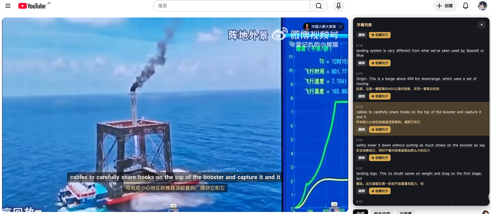
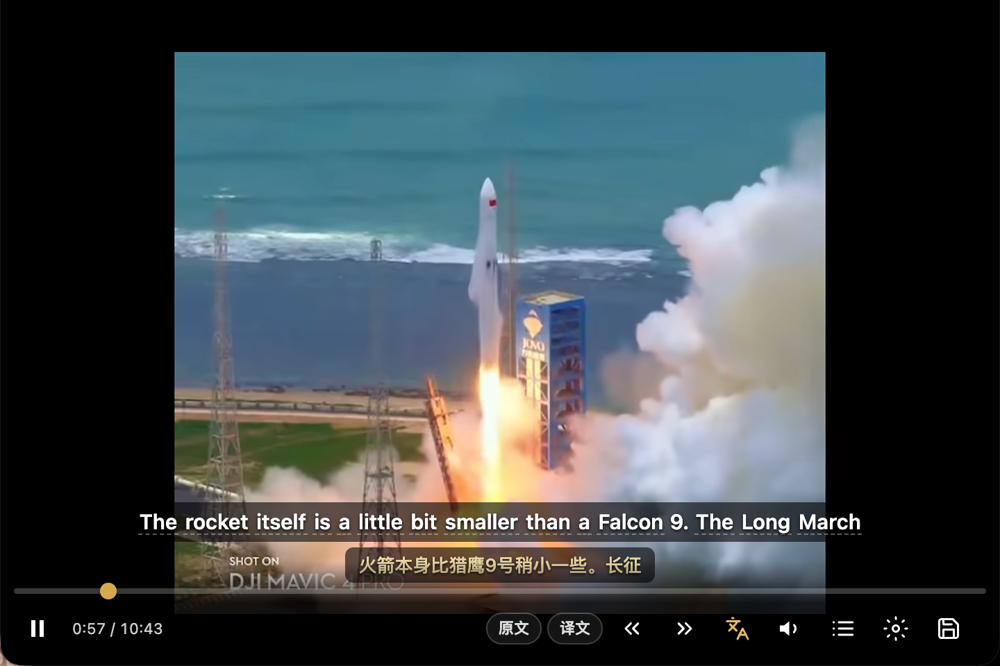
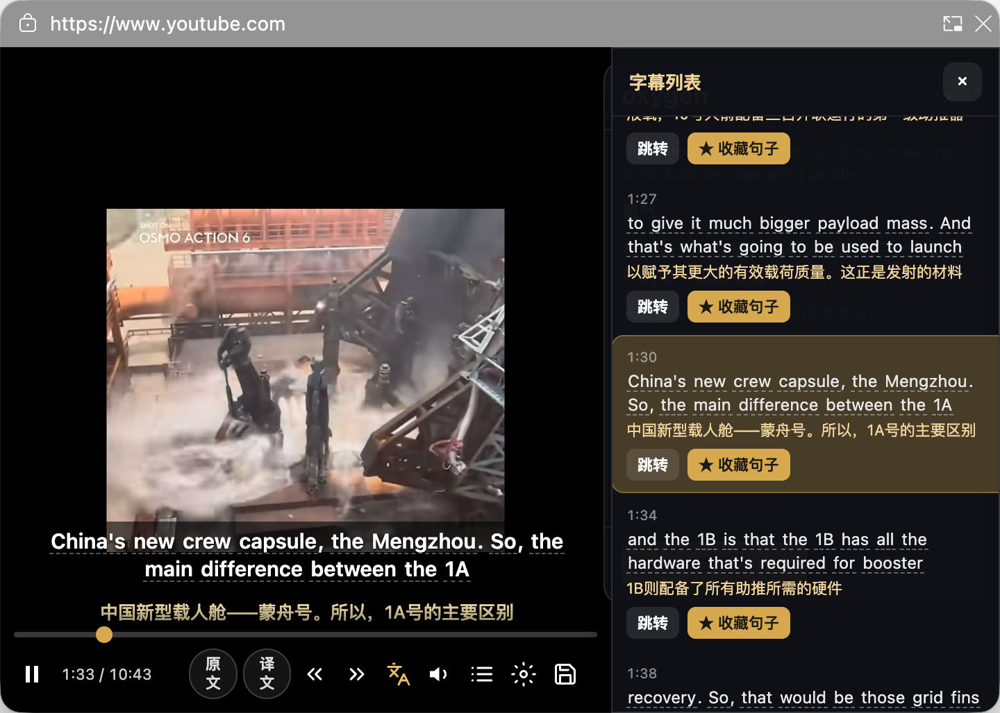
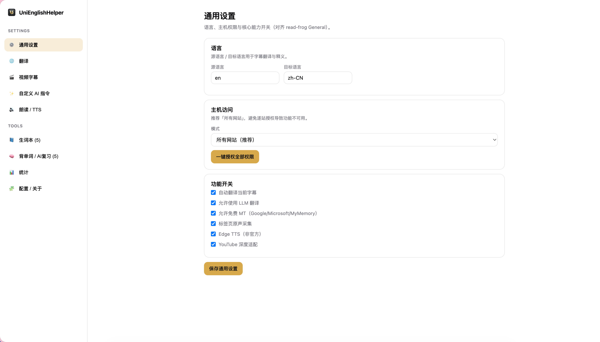
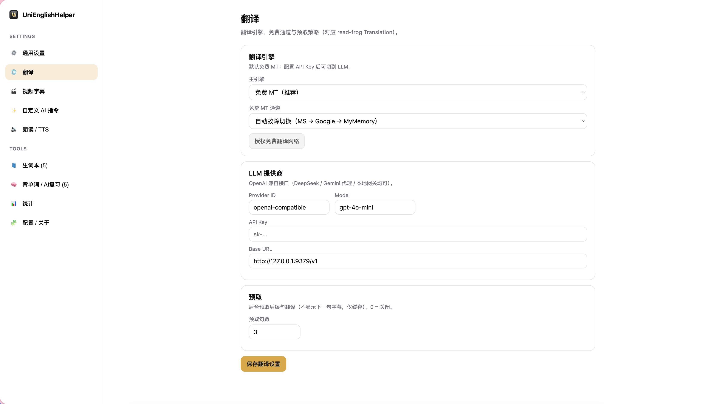
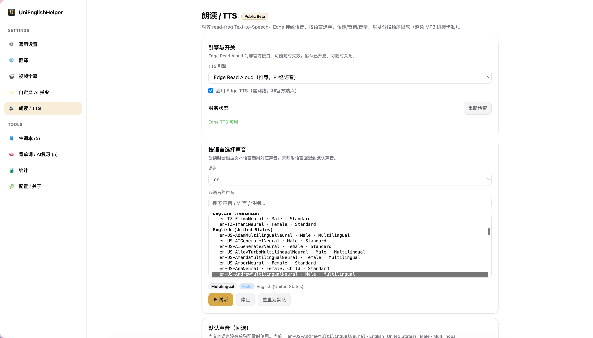
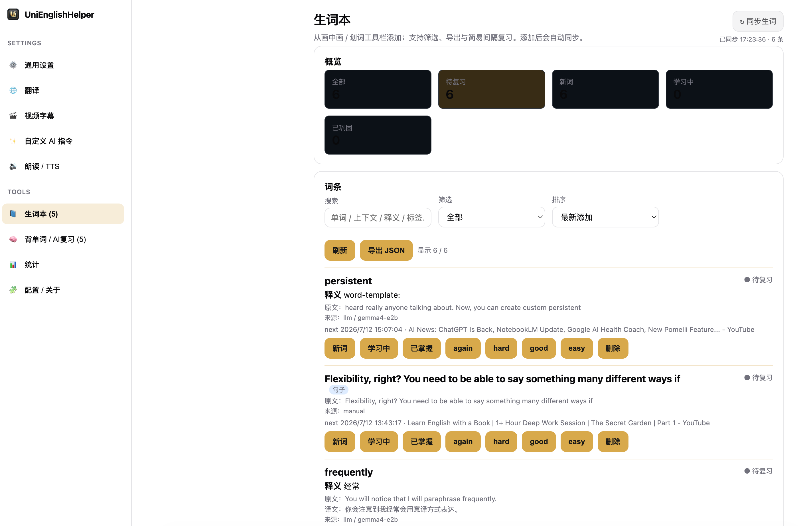
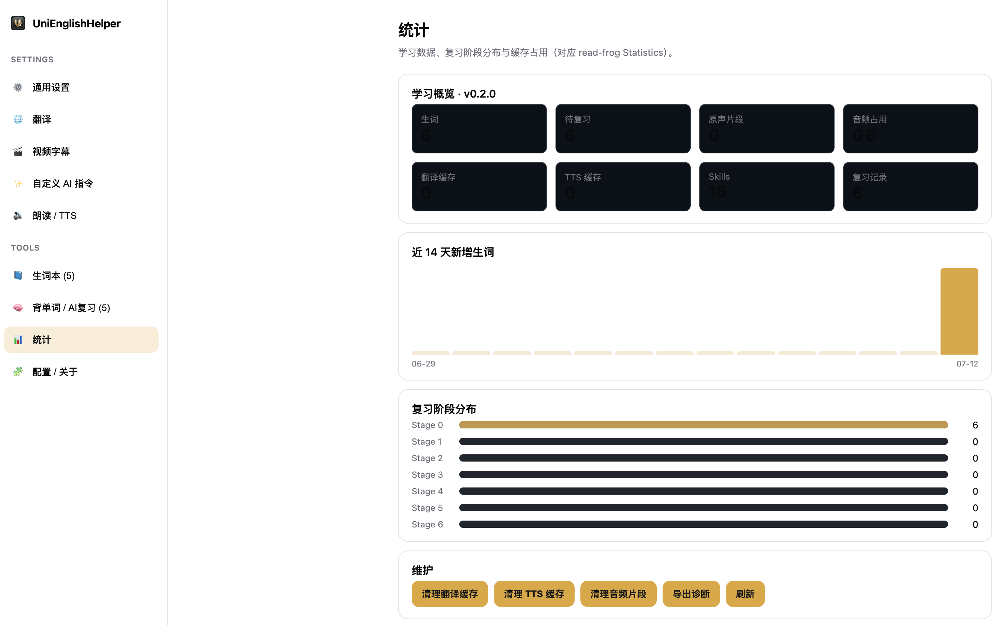

# UniEnglishHelper

Chrome / Edge (Chromium 116+) Manifest V3 extension for immersive English video learning.

**Core features**

- Document Picture-in-Picture with bilingual subtitles and clickable words
- Sentence audio capture (tabCapture + Offscreen loopback + PCM ring → WAV)
- Personal dictionary with simple spaced review
- OpenAI-compatible LLM translate / explain / custom Skills
- Web Speech TTS + Edge TTS (optional)

Architecture: see [`ARCHITECTURE.md`](./ARCHITECTURE.md).

## Screenshots

### YouTube + in-page learning

Full-page experience on YouTube: player overlay, bilingual cues, and the extension controls in context.



### Picture-in-Picture

Document PiP keeps the video and bilingual subtitles floating while you browse or take notes.



PiP plus the **subject / cue list** sidebar for jumping between lines, starring sentences, and reviewing context.



### Options — General

Site control, languages, and global extension preferences.



### Options — Translation

Translate engine, free MT, and OpenAI-compatible API key / model configuration.



### Options — Text-to-Speech

TTS engine, Edge neural voices, rate / pitch / volume, and preview.



### Dictionary

Saved words and sentences, filters, learning status, and spaced review actions.



### Statistics

Local usage stats and cache overview.



## License

**GPL-3.0-or-later**. YouTube subtitle pipeline and design tokens are adapted from
[read-frog](https://github.com/mengxi-ream/read-frog) (GPL-3.0). See `LICENSE`.

## Requirements

- Node.js ≥ 20
- pnpm (or npm)
- Chrome or Edge 116+

## Setup

```bash
cd UniEnglishHelper
pnpm install
pnpm build        # typecheck + production → dist/
pnpm test
pnpm fixture      # http://localhost:4173 demo page
# or
pnpm dev          # CRXJS HMR
```

### Load in browser

1. Open `chrome://extensions` (or `edge://extensions`)
2. Enable **Developer mode**
3. **Load unpacked** → select `dist/` (after `pnpm build`) or the CRXJS output folder printed by `pnpm dev` (usually `dist/`)
4. Pin the extension

## Daily usage

1. Open a page with an HTML5 `<video>` and subtitles (or use `fixtures/html5-learning-page/`)
2. Click the floating **UEH PiP** button (or Popup → **Open PiP**)
3. In the popup, click **Start capture** (required once per tab for original-audio save — extension must be invoked)
4. In PiP: translate, click words, TTS, **Save audio** for the current sentence
5. Open **Settings & dictionary** for API keys, review, Study (AI review), and Skills

Serve the fixture locally if track CORS blocks `file://`:

```bash
npx --yes serve fixtures/html5-learning-page -p 4173
# open http://localhost:4173
```

## Configuration

Options page (see screenshots above):

- **General** — source / target languages, site control
- **Translation** — free MT providers, OpenAI-compatible API key + base URL + model
- **TTS** — Web Speech / Edge voices, prosody, preview
- **Dictionary / Study / Statistics** — vocab, AI review, local metrics
- **Custom AI instructions** — built-in Skills (editable) + your own prompts

API keys live in `chrome.storage.local` and never go into content globals.

## Scripts

| Command | Description |
|---------|-------------|
| `pnpm dev` | Development build + HMR |
| `pnpm build` | Typecheck + production build |
| `pnpm test` | Vitest unit tests |
| `pnpm typecheck` | `tsc --noEmit` |

## Project map

```
src/
  background/   Service worker, router, capture orchestration
  content/      Video adapters, PiP session, media timeline anchors
  offscreen/    Loopback audio graph, PCM ring, WAV export → IDB
  pip/          Optional React PiP UI bundle
  popup/        Quick controls (PiP + capture invoke)
  options/      Settings, dictionary, study, skills
  shared/       Message IDL, domain types
  db/           Dexie schema + repositories
  api/          Translate + LLM clients
DOCS/Images/    Screenshots used in this README
fixtures/       HTML5 learning demo
```

## Implementation status (v0.2)

| Area | Status |
|------|--------|
| MV3 scaffold + message IDL | Done |
| Dexie words / clips / skills / cache | Done |
| Generic HTML5 PiP + subtitles + hotkeys | Done |
| Capture arm + PCM export + stop sync | Done (validate alignment on real tabs) |
| Dictionary / review / Study UI | Done |
| Dashboard + cache maintenance | Done |
| LLM translate / explain / skills + prefetch | Done (needs API key) |
| Web Speech TTS | Done |
| Edge TTS | Done (optional, settings page) |
| YouTube timedtext / player response | Best-effort (mirror mode) |

## Privacy notes

- Audio clips and dictionary stay local (IndexedDB)
- Optional unofficial free MT / Edge TTS are explicit user choices
- Capture records **tab mix** (ads may be included)
- DRM sites (Netflix, etc.) are out of scope
